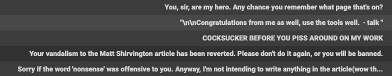

# Incivility in Public Language Discourse: A Sentiment Analysis
#### Daniel Kim


## Overview:

Sentiment Analysis within Natural Language Processing (NLP) has come a long way since its earlier days both in terms of its state-of-the-art leaps and bounds within this past year with regard to new network architectures, transfer learning, and along with these innovations, the ability to perform sentence classification with unparalleled accuracy.

However, one problem--a sizeable one--persists. Unlike other classification problems, Sentiment Analysis requires extensive labeling (by humans, and now, ML annotation) for the ostensible purpose of anthropomorphic inter-coder agreement. Other machine learning disciplines, of course, face the annotation problem, but it's far more prevalent in NLP (think how summarization might be annotated!) For example, in a Computer Vision classification task, it's a bit easier to identify / fail-to-identify something like a set of objects, cats/dogs, numerical readability or illegibility. Image ID can be bound by boxes--or not. These are all more ocular-centric, but everyday, commonsensical readability tasks. Human bias and politics are inclusive of many problems, NLP or otherwise, and especially so when the topic is polarizing, negative, and potentially offense. The organization publishing this dataset convey that they conduct occasional spot-checking and follow-ups with self-reported surveys in order to remove as much subjectivity they can from annotated labels.

## Purpose:

To predict the classification of reader comments accompanying online articles from the *New York Times*.  
This is a multi-categorical classification task using six different __toxic__ categories:
```python
Toxic
Severe Toxic
Obscene
Threat
Insult
Identity Hate
```  

A look at the initial data:  
```python
Total comments = 159571
Total clean comments = 143346
Remaining = 16225
Tagged = 35098
```  

  

But wait, why the discrepancy between remaining comments (16225) and those that are tagged (35098)? Why aren't they the same? In a word: multi-tagging. The label annotators followed a methodology in which they were instructed to tag as many categories as fit the criteria. I think this makes for more robust data and simultaneously a pain in the butt dataset. The existing class imbalance is made worse by constraining `clean` comments to unique counts while the rest can double, triple-dip, etc. across the classes. If the same criteria was applied to the `clean` class, the imbalance would be far greater. Thankfully, null values were not present in the data. The first step simply was to add an additional 'clean' feature column for the large amount of untagged text.

There is nearly a 10:1 majority/minority imbalance between clean/toxic comments!  Thus, I'll attempt to address the imbalance by either oversampling the minority class or undersampling the aggregate majority class.

  

## Technologies
- Tensorflow, Keras, Scikit-Learn, pandas, Numpy, NLTK, Matplotlib, Seaborn

## Preprocessing
The dataset needed a substantial amount of cleaning. Aside from commenters' use of poor syntax and spelling, items such as IP addresses, usernames, and extensions of files and images, multiple escape characters, strangely placed symbols (e.g., =, @, . ., "") appeared for no discernable reason, or in the least, out of place, and several places in the text displayed words stuck together with no white space in between.

The dataset initially came with eight features, and I selected one, "toxic," to predict its classification (1 = hit, 0 = miss). Across similar sentiment-based commenter datasets, negative sentiment generally is expressed at a highly reduced frequency compared to its counterparts in the minority class, and this dataset was no exception.

To address the class imbalance, the original dataset was randomly sampled to produce a more even split between majority and minority classes.

NLP Tasks:
- Stopwords: 
 - I used NLTK and Sklearn's stopword lists for removing standard and common words detracting from word frequency counts and analysis
- Stemming
 - I took the root of each word to better generalize tokens to the data and so that the algorithm could better find contextual similarity  
- Common contractions
 - this list changes contractions to their formalized roots, e.g., doesn't = does not; again this helps the algorithm to discern cleanly tokenized words and sub-words

n-grams (2)

More preprocessing:
IP address check:
- Leaving identifiable information intact with the comments easily causes data leakage if those IPs in the train set match those in the test set
- Same goes for any identifiable information
- So I conducted checks for IPs and usernames, and it turned out both were marginal in effect (e.g., only six overlapping IPs)
Regex Condition:


---
Results:
Class: toxic  

Precision
0.86      

Recall
0.74       

f1-score  
0.79  

