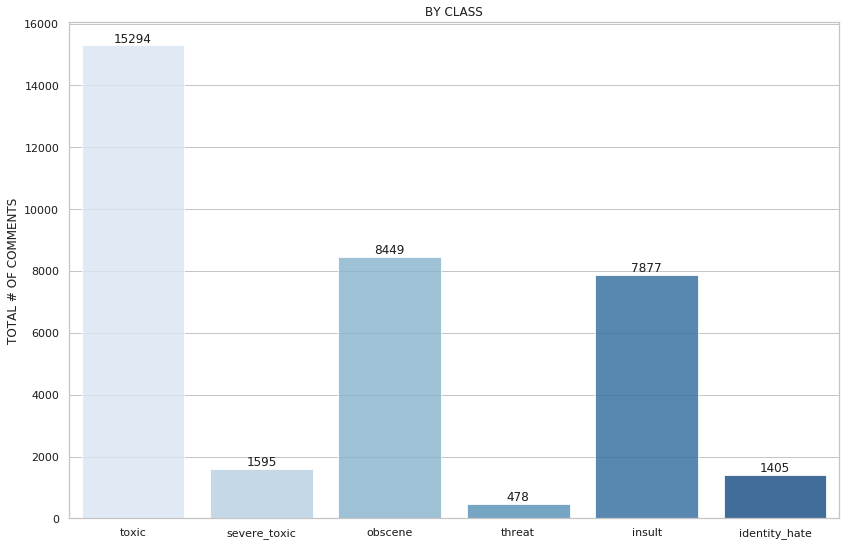

# Incivility in Public Language Discourse: A Sentiment Analysis
#### Daniel Kim

## Overview:

Sentiment Analysis within Natural Language Processing (NLP) has come a long way since its earlier days both in terms of its methodology and the innovations available to Data Scientists.

However, one problem--a sizeable one--persists. Unlike other classification problems, Sentiment Analysis requires extensive labeling (by humans) so that predictions have an actual target. Human bias and politics are inclusive of this problem, and especially so when the topic is polarizing, negative, and potentially offense. In the case of the organization from where I got my dataset, they conduct occasional spot-checking and follow-ups with self-reported surveys in order to remove as much subjectivity they can from annotated labels.

## Purpose:

To predict the classification of reader comments accompanying online articles from the *New York Times*. This is a multi-categorical classification task using six different "toxic" categories:
- Toxic
- Severe Toxic
- Obscene
- Threat
- Insult
- Identity Hate

A look at the initial data:  
  
The data held 159571 rows of comments across the six categories. Thankfully, null values were not present in the data. Of the 159571 comments, I found 143346 without a categorical tag. This left only 35098 marked as 'toxic' (meaning any falling into the six categories). Thus, the first step was to feature engineer an additional 'clean' column for the large amount of untagged text. While this helped to organize the features, it's likely you can see one conspicuous problem: major class imbalance. Even amongst the 'non-clean' categories, classes are imbalanced. However, the major problem and distinction remain between the toxic and 'clean' categories.  

  

## Technologies
- Tensorflow, Keras, Scikit-Learn, pandas, Numpy, NLTK, Matplotlib, Seaborn

## Preprocessing
The dataset needed a substantial amount of cleaning. Aside from commenters' use of poor syntax and spelling, items such as IP addresses, usernames, and extensions of files and images, multiple escape characters, strangely placed symbols (e.g., =, @, . ., "") appeared for no discernable reason, or in the least, out of place, and several places in the text displayed words stuck together with no white space in between.

The dataset initially came with eight features, and I selected one, "toxic," to predict its classification (1 = hit, 0 = miss). Across similar sentiment-based commenter datasets, negative sentiment generally is expressed at a highly reduced frequency compared to its counterparts in the minority class, and this dataset was no exception.

To address the class imbalance, the original dataset was randomly sampled to produce a more even split between majority and minority classes.

NLP Tasks:
- Stopwords: 
 - I used NLTK and Sklearn's stopword lists for removing standard and common words detracting from word frequency counts and analysis
- Stemming
 - I took the root of each word to better generalize tokens to the data and so that the algorithm could better find contextual similarity  
- Common contractions
 - this list changes contractions to their formalized roots, e.g., doesn't = does not; again this helps the algorithm to discern cleanly tokenized words and sub-words

n-grams (2)

More preprocessing:
IP address check:
- Leaving identifiable information intact with the comments easily causes data leakage if those IPs in the train set match those in the test set
- Same goes for any identifiable information
- So I conducted checks for IPs and usernames, and it turned out both were marginal in effect (e.g., only six overlapping IPs)
Regex Condition:

---
Results:
Class: toxic  

Precision
0.86      

Recall
0.74       

f1-score  
0.79  

