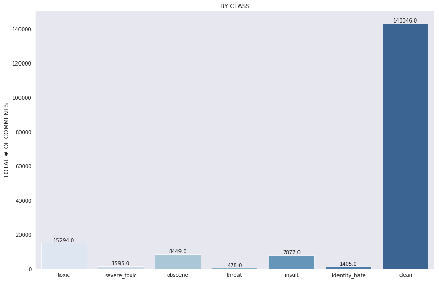

# Incivility in Public Language Discourse: A Sentiment Analysis
#### Daniel Kim


Table of Contents
<!--ts-->
 * [Overview](#overview)
 * [Purpose](#purpose)
 * [Data](#data)
 * [Technologies](#technologies)
 * [Preprocessing](#preprocessing)
 * [Feature Engineering](#feature-engineering)
 * [Model](#model)
 * [Results & Metrics](results-and-metrics)
<!--te-->

## Overview:

Sentiment Analysis within Natural Language Processing (NLP) has come a long way since its earlier days both in terms of its state-of-the-art leaps and bounds within this past year with regard to new network architectures (e.g., [transformers](https://papers.nips.cc/paper/7181-attention-is-all-you-need.pdf), [transfer learning](https://github.com/huggingface/transformers), and along with these innovations, the ability to perform sentence classification with unparalleled accuracy.  

However, one problem--a sizeable one--persists. Unlike other classification problems, Sentiment Analysis requires extensive labeling (by humans, and now, [ML annotation](https://arxiv.org/pdf/1903.06765.pdf) for the ostensible purpose of anthropomorphic inter-coder agreement. Other machine learning disciplines, of course, face the annotation problem, but it's far more prevalent in NLP (think how summarization might be annotated!) For example, in a Computer Vision classification task, it's a bit easier to identify / fail-to-identify something like a set of objects, cats/dogs, numerical readability or illegibility. Image ID can be bound by boxes--or not. These are all more ocular-centric, but everyday, commonsensical readability tasks.  

Human bias and politics are inclusive of many problems, NLP or otherwise, and especially so when the topic is polarizing, negative, and potentially offense. Regardless of the data science task, most annotations, especially within larger datasets, are crowdsource using various mechanisms such as Amazon Web Services or Mechanical Turk or self-reported annotation as with the Reddit comments marked by commenters as TL;DR for summarization and what OpenAI utilized to pretrain its infamous GPT-2. The organization publishing this [dataset](https://jigsaw.google.com) conveys that they conduct occasional spot-checking and follow-ups with self-reported surveys in order to remove as much subjectivity they can from annotated labels.  

## Purpose:

To predict the classification of reader comments accompanying online articles from Wikipedia's Talk Page site.  

This problem is a multi-categorical classification task containing __six toxic categories__:
```python
Toxic
Severe Toxic
Obscene
Threat
Insult
Identity Hate
```  
  
## Data
A look at the initial data:  
```python
Total comments = 159571
Total clean comments = 143346
Remaining = 16225
Tagged = 35098
```  


But wait, there's more. Or is it less? When looking at the plot which *includes* 'clean' comments, you'll notice a very strange distribution...

  

Got imbalance?  

So why the discrepancy between remaining comments (16225) and those that are tagged (35098)? Why aren't they the same? In a word: multi-tagging. The label annotators followed a methodology in which they were instructed to tag as many categories as fit the criteria. This makes for a more robust data and simultaneously a pain in the butt dataset. Across similar sentiment-based commenter datasets, negative sentiment generally is expressed at a highly reduced frequency compared to its counterparts in the minority class, and this dataset was no exception.

The existing class imbalance is made worse by constraining `clean` comments to unique counts while the rest can double, triple-dip, etc. across the classes. If the same criteria was applied to the `clean` class, the imbalance would be far greater. Thankfully, null values were not present in the data. The first step simply was to add an additional 'clean' feature column for the large amount of untagged text.

There is nearly a 10:1 majority/minority imbalance between clean/toxic comments! Thus, I'll attempt to address the imbalance by either oversampling the minority class or undersampling the aggregate majority class.  

But for now, here's a peek at a few comments. Each sample falls into one or more of the tagged categories to give you a sense of each class' criteria:

  


## Technologies
- Tensorflow, Keras, Scikit-Learn, pandas, Numpy, NLTK, Matplotlib, Seaborn

## Preprocessing
The dataset needed a substantial amount of cleaning. Aside from commenters' use of poor syntax and spelling, items such as IP addresses, usernames, and extensions of files and images, multiple escape characters, strangely placed symbols (e.g., =, @, . ., "") appearing for no discernible reason, or in the least, out of place, and several passages in the text displayed words stuck together without whitespace.  

NLP Tasks:
- Stopwords: 
 - I used NLTK and Sklearn's stopword lists for removing standard and common words detracting from word frequency counts and analysis
- Stemming
 - I took the root of each word to better generalize tokens to the data and so that the algorithm could better find contextual similarity  
- Common contractions
 - this list converts contractions to their formalized roots, similar to stemming for the specific case of contractions without redacting words (e.g., doesn't = does not); again this helps the algorithm to discern cleanly tokenized words and sub-words
- Regex
 - combined [regex](https://regexr.com) searches with the other cleaning tasks into a function

Before:  
```python
hay bitch 

thank you kindly for your advice on my vandalism but if your the dick who removed the thing abouth Berties make up costs Thats true... so ah FUCK  YOU
```

After:
```python
hay bitch thank kindly advice vandalism dick remove thing abouth berties make cost thats true ... ah fuck
```

Not very nice. Nor perfect, but inspected samples showed good stopword er, stoppage, [contraction conversion](https://www.kaggle.com/jagangupta/discussion), and tokenization as well. The important thing at this point is not to study the semantic structure of the original sentence but to clean data so that approximation and contextual distance are prepped before fitting to the model. So we need additional feature engineering to address the problem.

## Feature Engineering

IP address check:
- Leaving identifiable information intact with the comments easily causes data leakage if those IPs in the train set match those in the test set
- Same goes for any identifiable information such as duplicate usernames
After I conducted checks for IPs and usernames, and it turned out both were marginal in effect (e.g., minimal overlapping IPs)


Surprising, in the case of usernames, out of a total 239, all were unique except for one duplicate.

I addressed the class imbalance by bootstrapping the minority classes, re-sampling the distribution numerous times to ensure a better total sample. A major check on the success of the bootstrapping attempt included the cross-val results. In other words, I ran the algorithm across both the original, intact data and against the re-sampled effort as a check for conspicuous leakage.  

To my surprise, result were very similar, with and without resampling. This left me suspicious of other data leakage features. As a result, more text preprocessing and feature inspection was required. 

Again, the results held, even increasing the score by small margins. The suspicion primarily arose because the accuracy scores were so high in cross-validation that they were almost unbelievable. After googling for similar classification problems regarding sentiment commentary, I noticed that many other algorithms also performed very well for similar tasks.

After extensive preprocessing and feature engineering, I tokenized my data using Keras. First, I used the sklearn `TfidfVectorizer` to convert my words into values. I also tested this against the Keras version. Once again, results were minimally different. I chose Keras because of its inter-operability with TensorFlow which in turn could increase the speed of loaded arrays as tensors while processing through the model.

## Model  
I used a vanilla LSTM model with modifications. I set my max sequence length at 256 (the length of sentences as input); per usual, any sentence not reaching the max length got padded so the arrays were of the same size.  


Here's what the model looks like:  

  
NB: "None" means that keras is inferring shape which is a nice feature, IMO  

---
And here's my detailed description of each layer in the network:  
- Start: LSTM input layer: encodes the input per length settings (e.g., max length)  
- -----> Embedding layer: projects coordinates passed from the input layer into a vector space and sets the initial contextualization and distances in space based on similarity and relevance (e.g., dog is positioned close to cat). In doing so, the layer also reduces dimensionality while determining further parameters such as `max_features` or unique words before passing these onto the next layer.  
- -----> The actual LSTM layer is next. Its primary purpose is recursion with respect to major hyperparameters. Here, we can tune for batch size, number of words as input, learning rate, etc. It accepts variables as each word in a sentence. It can take two options--to take the final recurrent output--or to 'roll out' the LSTM so that previous output is passed back into the LSTM layer with each recurrent pass (i.e., total output). In our case, that would be 256 recursions. Significantly, we use TensorFlow to reduce a 3-d tensor into 2-d space to normalize and retain as much of the useful data as possible before passing data into the next layer.
- -----> Our next layer is the CNN-borrowed global [max-pooling layer](https://www.kaggle.com/sbongo/discussion). Because language tasks blow up quite easily in terms of dimension bloat, the max-pooling layer takes the aggregate of each batch to determine maximum values while dropping less relevant features, furthering the process of dimension reduction.  
- -----> Next comes the first of two dropout layers. Essentially, dropouts are meant to increase generalization of data by randomly 'dropping out' nodes in the network. Thus, the next layer must try to make sense of the updated data, kind of like a non-recursive generator-discriminator relationship as seen in GANs.  
- -----> The dropout layer feeds the next dense layer, and the important thing here is what it outputs--a ReLU activation function which in short can be describe as `Activation((Input X Weights) + Bias)`. The ReLU sums the output, and if positive, passes straight to the node input. If negative, it outputs zero. ReLU also greatly reduces the 'vanishing gradient' problem enabling higher performance from networks.
-------> Another dropout layer is fed from the previous dense layer, again to help generalize to the data.
-------> Finally, the data is passed to the final (dense) layer where the data is normalized by a sigmoid function. The takeaway here is that the sigmoid 'squishes' the data into a human-readable scale of 1's and 0's since we are engaged in a classification task.  


## Results & Metrics

I've defined loss with binary cross-entropy (again, works well for classification) and utilize the popular Adam optimization technique.

My metrics included accuracy, loss, f1, precision, recall  
*as of keras 2.3, only accuracy and loss are included as built-in functions  
*remaining metrics are calculated by scratch within my own function

After 22 epochs:  
- test loss: 0.0472
- test acc: 0.9829
- test f1: 0.7476
- test precision: 0.8063
- test recall: 0.7071

Could be better--but overall, not too shabby at all. Especially so since the LSTM did not utilize any external word embeddings (e.g., FasText) or pretrained weights. Re-tuning hyperparameters certainly would be my next move if this project were to continue, although I did experiment quite a bit between training and val runs. Interestingly, the batch size parameter thus far is most influential in score fluctuation. Generally, doubling the batch size began an epoch with a higher score than the preceding ones with smaller batch sizes. However, it converged much more quickly, and loss increased with each subsequent epoch. The default learning rate of 1e-03 was manipulated by incremental changes to little effect. Yet, I would need to try more extremes and less conservative decisions, there. The most difficult part of retuning will be the inputs, outputs of each layer, including when / how much to drop-out, trying other loss functions other than ReLU, determining the number of overall layers, and attending to the actual LSTM and its 'remembering' plus gating capacities. Other than the embedding layer which understandably has the most hyperparameters, the LSTM requires the most attention and perhaps tweaks to the weights and layer architecture surrounding it. Of course, two LSTMs in one network may also yield significant improvement.  
___
